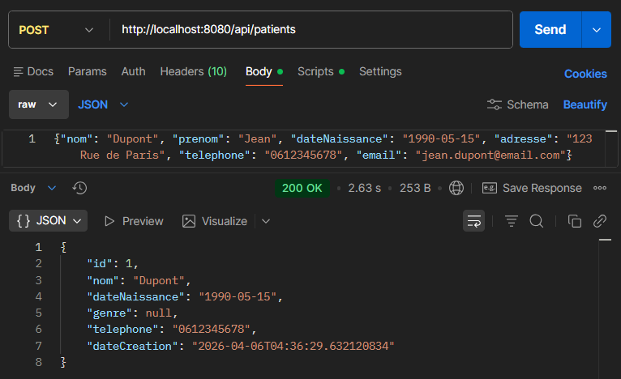
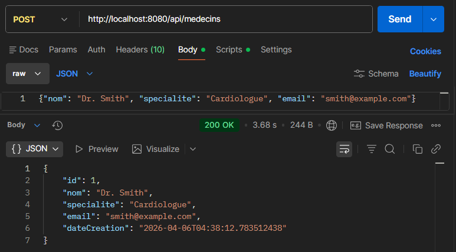
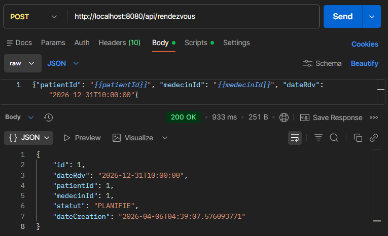
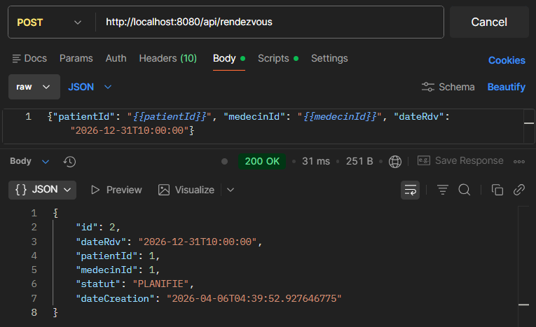
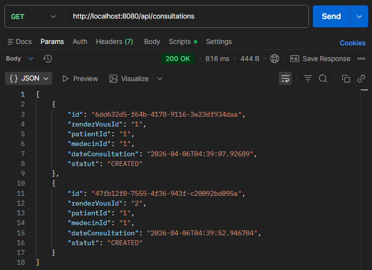
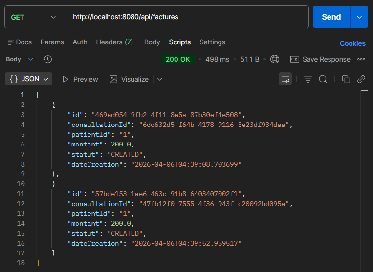
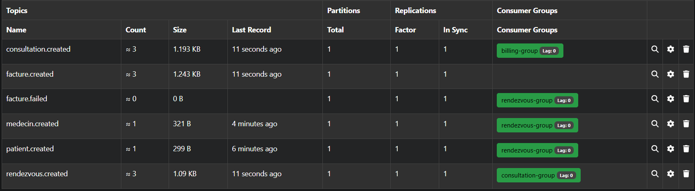

# TP4 – Architecture Event-Driven (EDA) avec Kafka
## Gestion d’un Cabinet Médical

Cours assuré par : Jaouad OUHSSAINE  
Master IPS — Module : Systèmes Distribués Basés sur les Microservices  
Contact : jaouad.ouhs@gmail.com | jaouad_ouhssaine@um5.ac.ma

---

## Contexte

Dans le TP3, les microservices communiquaient via des appels REST synchrones.

### Limites observées

- Couplage fort entre services
- Dépendance à la disponibilité des autres services
- Risque d’erreurs en cascade
- Scalabilité limitée
- Temps de réponse dépendant des autres services

---

## Objectif du TP4

Faire évoluer l’architecture vers une :

Architecture Event-Driven (EDA) basée sur Apache Kafka

### Principes introduits

- Communication asynchrone
- Découplage fort entre services
- Modèle Publish / Subscribe
- Consistance éventuelle
- Saga distribuée par chorégraphie

---

## Architecture globale

L’architecture repose désormais sur :

- Un API Gateway (exposition REST externe uniquement)
- Un Kafka Event Bus
- Des microservices autonomes
- Une base de données par microservice
- Une communication exclusivement événementielle entre services

Les services ne s’appellent plus via REST.  
Ils communiquent via des événements Kafka.

---

## Commandes pour le déploiement Docker

Pour compiler, construire et démarrer les conteneurs Docker de tous les microservices, utilisez les commandes suivantes :

1. Paramétrer votre projet (en ignorant les tests) :
    ```bash
    mvn -DskipTests package
    ```

2. Construire les images Docker sans cache :
    ```bash
    docker compose build --no-cache
    ```

3. Démarrer les conteneurs en arrière-plan et reconstruire si nécessaire :
    ```bash
    docker compose up -d --build
    ```

4. Pour arrêter et supprimer les conteneurs :
    ```bash
    docker compose down
    ```

---

## Scénario de test

Voici un exemple pas à pas de la création de différentes ressources :

1. **Création d'un patient**  
   

2. **Création d'un médecin**  
   

3. **Création d'un rendez-vous** (déclenche automatiquement la création d'une consultation, puis d'une facture)  
     
   

4. **Vérification des consultations**  
   

5. **Vérification des factures**  
   

6. **Aperçu des topics dans Kafka UI**  
   
